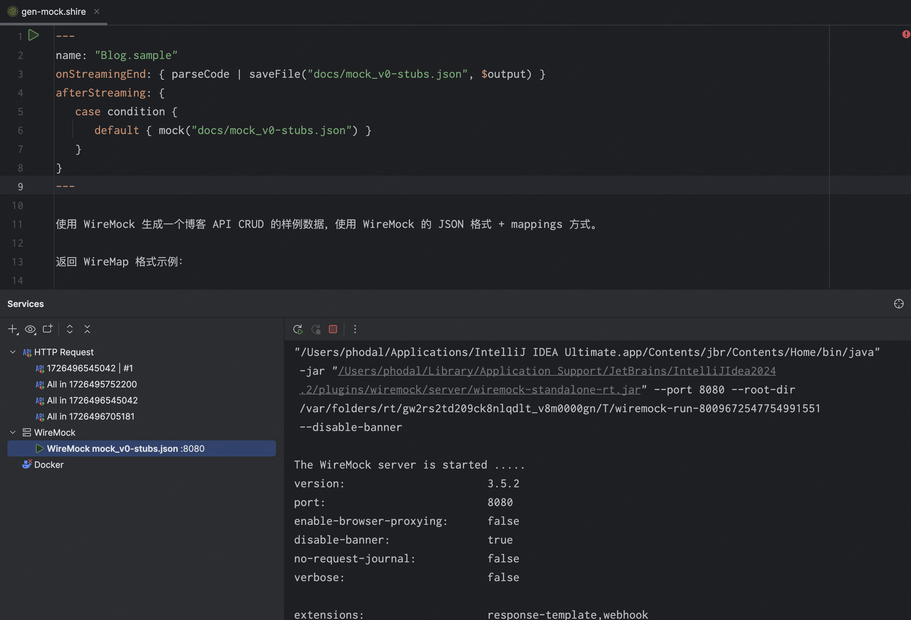

# Shire Lang Spring/Java Demo project

Shire offers a straightforward AI Coding Agent Language
that enables communication between an LLM and control IDE for automated programming.

Shire 集成了大量的 IDE 插件能力支持，可以直接由 LLM 处理，实现自动化编程，如 Swagger API 生成、WireMock Mock Server
生成、Mermaid 图生成等。

## ScreenShots

### `approvalExecute` function

See in: `.shire/approve/approve.shire`

### `showWebView` function

React demo see in `.shire/frontend/react-mock-up.shire`

### `mock` function

`.shire/api/mock/gen-mock.shire`

### `openFile` function

Mermaid See in: `.shire/toolchain/mermaid.shire`

## LICENSE

This code is distributed under the MPL 2.0 license. See `LICENSE` in this directory.
