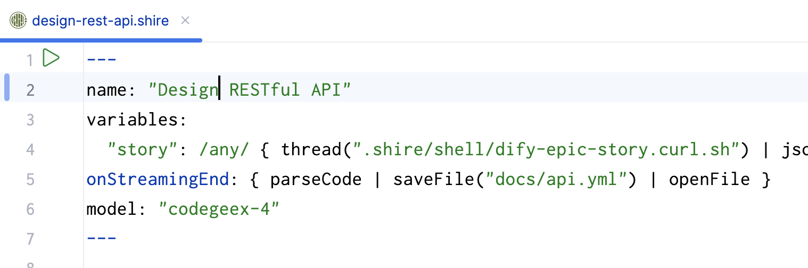

# Shire Demo project

Shire offers a straightforward AI Coding Agent Language
that enables communication between an LLM and control IDE for automated programming.

特点：

- 自定义团队智能助手。Shire 将 prompt（提示词）变成代码，使得你可以在代码库中共享你的智能编码能力，并且可以直接执行。你还可以将 Shire 代码存储在全局（~/.shire），以便于在你的所有项目中使用。
- 丰富的开发工具生态。我们分析了开发者的编码旅程，提炼出常用工具和 IDE 插件的核心能力：从内置的 Git 到外部的 mock 服务工具 Wiremock等。通过将这些功能灵活封装为变量和函数，支持高效的应用开发。
- AI 上下游与 DevOps 编排。通过整合上游的 AI 智能体、本地文件和知识库，扩展 IDE 所需的上下文信息，以提升模型生成质量。设计并构建与 DevOps 规范和工具链深度融合的系统，优化软件开发流程与全链路效能。
- 快速原型。在 IDE 中一键运行 AI 提示词，将智能与项目上下文相结合，快速构建功能原型，快速创建编码智能体。与此同时，灵活调整开发流程和迭代运作模式，探寻最优 AI 辅助开发方案。

## Getting Started

1. Open IntelliJ IDEA MarketPlace, search `Shire` and install it.


2. Create a new Shire file, and copy the code from `.shire/api/design/design-rest-api.shire` to the new file.

```shire
---
name: "Design RESTful API"
variables:
  "story": /any/ { thread(".shire/shell/dify-epic-story.curl.sh") | jsonpath("$.answer", true) }
onStreamingEnd: { parseCode | saveFile("docs/api.yml") | openFile }
---

You are a senior developer, designing a RESTful API according to the user story.

User Story:

$story

Please design the RESTful API according to the user story using Swagger format and return the designed API.
```

3. Click `Run` Icon to start Shire.



4. Shire will auto run and show the result in the view.


## ScreenShots

### `approvalExecute` function

See in: `.shire/approve/approve.shire`


### `showWebView` function

React demo see in `.shire/frontend/react-mock-up.shire`


### `mock` function

`.shire/api/mock/gen-mock.shire`


### `openFile` function

Mermaid See in: `.shire/toolchain/mermaid.shire`


## LICENSE

This code is distributed under the MPL 2.0 license. See `LICENSE` in this directory.
